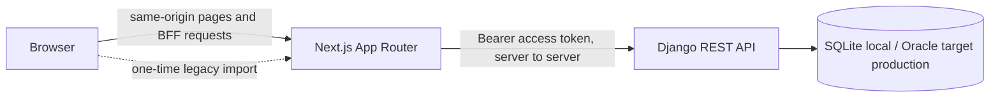
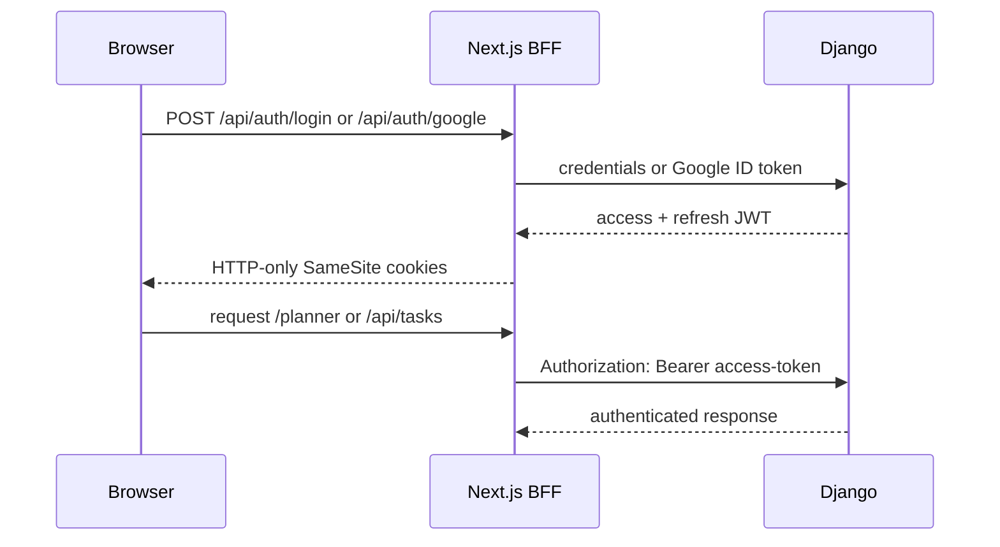
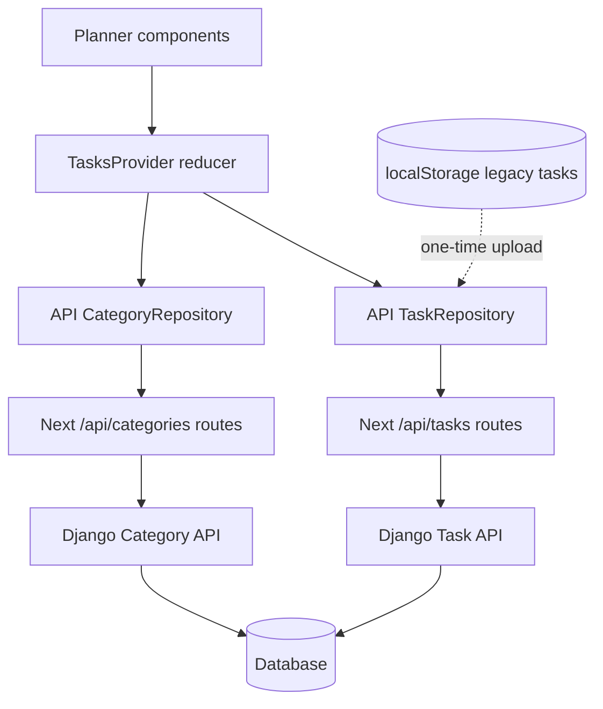

# Architecture

_Current-state document. Last verified against the codebase: 2026-08-06._

## System context

Picking Up is a task-planning web application with a Next.js browser/BFF layer
and a Django REST API. Django and its database are the persistent authority for
accounts, categories, and tasks. Browser localStorage is retained only as a
one-time legacy import source.



The browser never receives Django JWT values through JavaScript. Next.js stores
the access and refresh tokens in HTTP-only cookies and attaches the access token
to Django requests on the server.

## Technology

| Concern | Current implementation |
|---|---|
| Web application | Next.js 15 App Router, React 19, TypeScript |
| UI | Tailwind CSS 4, Base UI primitives, CSS-variable design tokens |
| Client state | React context and reducer |
| Browser data boundary | `TaskRepository` and `CategoryRepository` interfaces |
| Backend | Django 5, Django REST Framework |
| Authentication | Simple JWT plus Google ID token exchange |
| Local database | SQLite |
| Target production database | Oracle Autonomous Database on OCI |
| Frontend tests | Vitest, Testing Library, jsdom |
| Backend tests | Django test runner and DRF `APIClient` |

## Repository layout

```text
picking-up/
├── backend/
│   ├── config/                 Django settings, URLs, WSGI/ASGI, logging
│   └── apps/
│       ├── accounts/           registration, login, Google identity, logout
│       └── tasks/              Task and Category models and REST endpoints
├── frontend/
│   └── src/
│       ├── app/                pages and same-origin BFF route handlers
│       ├── components/         shared UI primitives and site chrome
│       ├── features/auth/      auth UI and Django auth clients
│       ├── features/tasks/     task domain UI, state, mapping, repositories
│       ├── lib/                shared server API and cookie helpers
│       └── middleware.ts       page protection and access-token refresh
├── docs/
│   ├── architecture.md        this current-state document
│   ├── refining/              verified engineering issue register
│   ├── planning/              product/backend direction and runbooks
│   └── superpowers/           historical feature specs and execution plans
└── setup/                     local development instructions
```

The authenticated workspace is `/planner`. References to `/app` in dated specs
and historical records describe the route name at the time those documents were
written; they are not the current route contract.

## Authentication flow



- Django is the verification and authorization authority.
- Next middleware decodes access-token expiry only to decide whether to attempt
  refresh; it does not treat decoding as signature verification.
- Access tokens live for 15 minutes. Refresh tokens live for 14 days and rotate
  with blacklist-after-rotation enabled.
- Password login uses Simple JWT's standard serializer and a Django email
  authentication backend. Unknown email addresses still perform password-hash
  work, and wrong-password, unknown-user, and inactive-user attempts share the
  same 401 response contract.
- Login, registration, and Google sign-in each have independent IP-based burst
  and sustained throttles. Production workers on the documented single VM
  share file-backed cache state; a multi-host deployment requires a distributed
  cache such as Redis.
- `/planner` is protected by middleware. `/api/tasks` and `/api/categories`
  participate in refresh because they are called without page navigation during
  a long-running planner session.
- Logout is best effort at the Django boundary and always clears browser cookies.

## Task and category data flow



The repository interfaces keep React components independent of HTTP details.
Camel-case frontend values are mapped to the Django API's snake-case contract at
the server-side API boundary. On first load, valid legacy localStorage tasks are
uploaded individually; successfully migrated rows are removed from localStorage.

### Backend resources

The API currently exposes:

```text
POST /api/auth/register/
POST /api/auth/token/
POST /api/auth/token/refresh/
POST /api/auth/google/
POST /api/auth/logout/
GET  /api/auth/me/

GET, POST                 /api/tasks/
GET, PUT, PATCH, DELETE   /api/tasks/{uuid}/          (PUT/PATCH/DELETE require If-Match)
POST                      /api/tasks/{uuid}/commands/nest/
POST                      /api/tasks/{uuid}/commands/promote-subtask/
GET, POST                 /api/categories/
PATCH                     /api/categories/{uuid}/
```

Every task and category queryset is filtered by `request.user`; foreign-key
inputs are also scoped to the authenticated owner. Cross-owner object access is
therefore returned as 404, while invalid cross-owner relationship inputs are
rejected as validation errors.

## Domain boundary

The backend currently owns:

- authentication and user identity;
- per-user authorization and relationship ownership;
- persistent Task and Category records;
- server-generated creation/completion timestamps;
- schema and data migrations; and
- converting a task to a subtask, and promoting a subtask to a task —
  `POST /api/tasks/{id}/commands/nest/` and `.../commands/promote-subtask/`
  each run as one atomic, row-locked, version-checked server transaction
  (see "Optimistic concurrency" below) that re-validates every domain rule
  server-side (no self-nest, no nesting a task that already has subtasks or
  is part of a repeat series, no discarding task-only fields without
  explicit confirmation). The frontend calls these commands instead of
  composing generic PUT/DELETE requests for these two operations.

The frontend still owns task business operations that persist through generic
CRUD calls with no cross-record atomicity:

- detaching from a routine, deleting an occurrence, rescheduling, and
  reordering — fractional ordering and rescheduling rules for these still
  live client-side and can be bypassed by a direct API caller; and
- rollover and routine materialization, where two sessions can independently
  create different UUID occurrences for the same anchor/date.

Moving detach/delete/reschedule/reorder to explicit transactional server
commands is RF-005. Moving day-boundary rollover/materialization to one
idempotent server authority with an occurrence uniqueness invariant is the
separate RF-017. Both are tracked in
[`docs/refining/`](refining/README.md). One related gap remains: deleting a
Category `SET_NULL`s `bucket_category` on its Tasks without bumping their
`version`, the same class of issue already closed for the repeat-anchor
case (deleting an anchor Task correctly bumps its occurrences' `version`).
This is currently unreachable through the API — there is no Category delete
endpoint — so it isn't a live gap today, only a landmine for whenever one is
added.

## Data model notes

- Task IDs are client-generated UUIDs because optimistic UI needs identity
  before persistence completes. The server rejects duplicate IDs and ignores
  ID changes during updates.
- `Task.created_at` and `Task.completed_at` are server-owned `DateTimeField`
  values. Migrations 0007-0009 converted the original string fields through
  nullable shadow columns and an explicit data backfill.
- `repeat_source` is a self-referential foreign key with `SET_NULL` deletion.
- Category IDs are UUIDs. Category identity is derived with Unicode NFKC plus
  `casefold()` and enforced by a `(user, normalized_name)` database constraint;
  display casing remains in `name`. Runtime validation and migration preflight
  reject normalized keys beyond the 180-character storage boundary.
- Subtasks, repeat weekdays, and excluded dates are JSON collections fetched as
  part of their Task row. They are not relational prefetch targets.
- `order` is a floating-point rank used to insert between neighbors without
  rewriting every sibling row.

## Error and consistency model

The planner applies optimistic local state and sends persistence operations in
the background. A failed write raises a visible sync-error state and completes a
full server resync before the next queued mutation. Generic edits are stored as
field/subtask deltas and rebased onto the refreshed authoritative Task, so a
failed optimistic command cannot leak partial state through a later full PUT.
Browser task requests abort after 15 seconds. There is no offline write queue.

Every Task carries a monotonic `version`, incremented on each accepted write.
Generic Task `PUT`/`PATCH`/`DELETE` require an `If-Match: "<version>"` header:
missing it is `428`, a malformed value is `400`, and a stale version is `409`
with the current server version in the body — so two clients can no longer
silently overwrite each other's changes on these paths. A successful `GET`
also exposes the current value as an `ETag`. The two transactional commands
(nest, promote-subtask) carry the same precondition for every Task row they
touch and roll back completely on any conflict or domain-rule violation — see
"Domain boundary" above. The remaining multi-record task operations (detach,
delete-occurrence, reschedule, reorder) are not yet covered by this and can
still partially succeed; closing that gap is the rest of RF-005.

Backend and BFF errors do not yet share one stable envelope. Auth routes now
preserve upstream status and `Retry-After`, but body shapes and field errors
remain inconsistent across API families. This is tracked as RF-014.

## Deployment and operations

The documented target is:

```text
Next.js -> Vercel
Django  -> gunicorn + nginx on an OCI VM
Database -> Oracle Autonomous Database
```

The manual procedure is in
[`docs/planning/7. deployment-runbook.md`](planning/7.%20deployment-runbook.md).
That runbook is a target procedure, not proof that the current commit is live.
Its nginx topology sets `DJANGO_NUM_PROXIES=1`, and its gunicorn workers share
the private `backend/.cache` throttle directory. DRF's built-in throttle remains
a deliberately fuzzy abuse control under concurrent requests, not a billing or
hard-quota mechanism.
CI runs backend and frontend checks on pushes and pull requests. Oracle
integration-test permissions, health endpoints, multi-process-safe logging,
backup/restore verification, and exercised rollback remain open work. The
manual runbook now stops old gunicorn writers for migration cutovers and warns
that automatic frontend deployment is not an ordered cross-boundary release.

## Verification baseline

As of the last 2026-08-06 verification:

- backend: 113 tests passed on the SQLite test fallback, and `manage.py check`
  reported no issues;
- migrations: `makemigrations --check --dry-run` reported no changes;
- frontend: 763 tests across 53 files passed, and `tsc --noEmit` passed;
- lint completed with zero errors; its existing warnings remain tracked by
  RF-016;
- relative Markdown links: no broken local links were found; and
- the Next.js production build completed successfully after the local dev
  server holding `.next/trace` was temporarily stopped and then restored.

These backend results use SQLite. The Oracle test attempt could not create a
test schema because the configured user lacked the required privilege
(`ORA-01031`), so Oracle behavior remains explicitly unverified under RF-012.

Current issues and their acceptance criteria live in
[`docs/refining/README.md`](refining/README.md). Resolution notes must be added
there when an issue is closed so architecture claims stay tied to evidence.
