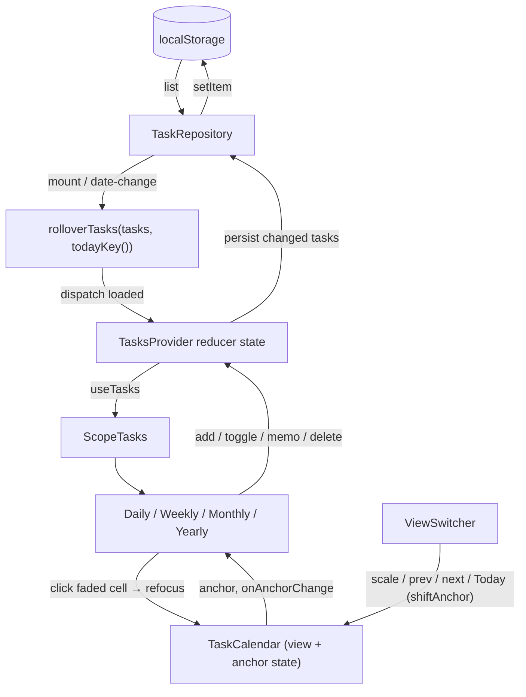
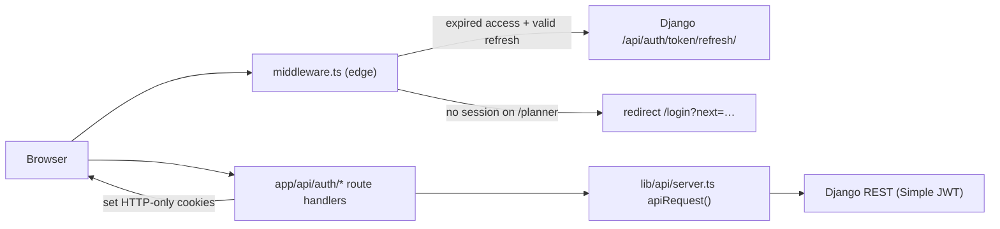

# Architecture

_Last updated: 2026-07-16 (post task-calendar merge)._

## Stack

| Layer | Technology |
|---|---|
| Frontend | Next.js 15 (App Router), React 19, TypeScript |
| Styling | Tailwind CSS 4 with CSS-variable design tokens, Base UI primitives (shadcn-style) |
| State | Plain React context + reducer (no state library) |
| Persistence (current) | `localStorage` behind a repository interface |
| Backend | Django + DRF + Simple JWT (auth endpoints live; task API planned) |
| Database | SQLite locally, PostgreSQL/Oracle (OCI) for production |
| Testing | Vitest + Testing Library + jsdom |

## Repository layout

```
picking-up/
├── frontend/
│   └── src/
│       ├── app/                    # Next.js App Router
│       │   ├── page.tsx            # Landing page (Tesla-minimal, task mock hero)
│       │   ├── login/ signup/      # Auth pages
│       │   ├── app/                # Protected task workspace (the calendar)
│       │   └── api/auth/*          # Route handlers proxying Django auth
│       ├── middleware.ts           # Route protection + JWT refresh at the edge
│       ├── components/             # Shared UI (wordmark, theme-toggle, auth-layout, ui/*)
│       ├── features/
│       │   ├── auth/               # api client, auth-form, logout-button, types
│       │   └── tasks/              # the task-calendar feature (see below)
│       └── lib/                    # cross-cutting: api/server.ts, auth/cookies.ts, utils.ts
├── backend/                        # Django project (config/, apps/accounts)
└── docs/
    ├── architecture.md             # this file
    ├── conventions.md              # coding style & process conventions
    ├── development-record.md       # chronological build record
    ├── planning/                   # owner's working notes
    └── superpowers/
        ├── specs/                  # approved design specs (source of truth for behavior)
        └── plans/                  # TDD implementation plans executed against the specs
```

## Feature-folder architecture

Code is organized by **feature**, not by technical layer. Each feature folder owns its
types, logic, data access, state, and components; only genuinely shared things live in
`components/` and `lib/`. The task feature is the reference example:

```
features/tasks/
├── types.ts                # Task, Scope (discriminated union), scopeKey()
├── lib/
│   ├── dates.ts            # pure date-key math (grid building, week/month keys)
│   └── rollover.ts         # pure rollover rules
├── data/
│   └── repository.ts       # TaskRepository interface + localStorage implementation
├── store.tsx               # TasksProvider (context + reducer) — the only stateful layer
├── test-utils.tsx          # fakeRepository, makeTask
└── components/
    ├── period-cell.tsx     # focused/faded cell (the core visual pattern)
    ├── scope-tasks.tsx     # connected task list for one scope
    ├── task-item.tsx  quick-add.tsx  view-switcher.tsx  task-calendar.tsx
    └── views/
        ├── weekly-view.tsx  # exports CalendarViewProps + DAY_LABELS
        ├── daily-view.tsx   # default
        ├── year-grid.tsx    # shared by monthly + yearly
        ├── monthly-view.tsx
        └── yearly-view.tsx
```

**Layering rule (dependencies point downward only):**

```
views → primitives (PeriodCell, ScopeTasks) → store → repository → storage
                    all of the above → lib/ (pure functions) + types
```

`lib/` and `types.ts` import nothing from the layers above them; the store is the only
place that touches the repository; components never touch storage directly.

## Design patterns

### 1. Repository seam (swappable persistence)

`TaskRepository` (`data/repository.ts`) is an async CRUD interface
(`list / create / update / remove`). Today it's backed by `localStorage`
(key `picking-up.tasks.v1`), resolved **lazily inside methods** so the factory is
SSR-safe. When the Django task API lands, an HTTP implementation replaces it without
touching the store or any component. Reads are schema-validated (`isTask`/`isScope`
check the discriminated union's payload fields); corrupt data degrades to `[]`
instead of crashing.

### 2. Pure functional core

All date math and business rules are pure functions over **string date keys**
(`"2026-07-16"`, week = its Sunday's key, `"2026-07"`, `"2026"`). Ordering is ISO
string comparison — `Date` objects are never compared, only used internally for
arithmetic. `rolloverTasks(tasks, today)` is deterministic and returns the *same
object reference* for unmoved tasks, which both makes tests meaningful and lets the
store persist only what actually changed.

### 3. Context + reducer store

`TasksProvider` holds `{ loaded, tasks }` via a pure `tasksReducer`. Effects:

- **Mount:** `repo.list()` → `rolloverTasks(tasks, todayKey())` → dispatch `loaded` →
  persist only reference-changed tasks.
- **Date change:** `window focus` / `document visibilitychange` listeners re-run
  rollover when `todayKey()` differs from the last-applied day (tab left open across
  midnight still rolls).
- **Actions** (`addTask`, `toggleTask`, `setMemo`, `removeTask`) dispatch optimistically
  and persist fire-and-forget.

Rendering is gated on `loaded` so server and client markup match (hydration safety).

### 4. "Zoomed-out context, focused present" (the UI concept)

Every calendar view renders the **parent time container** with the current unit
focused and the rest faded: Daily shows the week (today focused), Weekly shows the
month (current week's row expanded), Monthly shows the year (current month
highlighted), Yearly shows the year plain. The nesting is Daily ⊂ Weekly ⊂ Monthly ⊂
Yearly. Two primitives carry the whole pattern:

- **`PeriodCell`** — one component, two states. Focused: highlighted container.
  Faded: `opacity-50`, `role="button"` (click / Enter / Space refocuses), children
  made non-interactive via `pointer-events-none`.
- **`ScopeTasks`** — the single connected component; give it a `Scope` and it renders
  that scope's tasks (`compact` = dimmed titles for faded cells, `quickAdd` = editable).

Each view is then just grid layout + these two primitives. Monthly/Yearly share
`YearGrid`, where grid cells are always compact previews and the wide side cell
("Weekly" / "Monthly" / "Yearly") is the focused period's editing workspace.

### 5. Rollover (unfinished work follows you forward)

1. A day task left unchecked after its day passes → that week's **Weekly cell**,
   marked with `rolledFrom` (original scope, preserved across repeated rolls).
2. A week task unfinished at week's end → the **next week's** Weekly cell (repeated
   rolls collapse into one jump to the current week).
3. A month task from a past month → the current month. Year tasks stay put.
   Completed tasks are never touched.

## Data flow



Navigation state is two values in `TaskCalendar`: `view` (which scale) and `anchor`
(a date key). `shiftAnchor` pages the anchor per scale (daily ±7 days, weekly ±1 month
to the 1st, monthly/yearly ±1 year keeping the month); clicking a faded unit sets the
anchor directly. Refocus clicks always pass an in-month date so the visible grid never
jumps unexpectedly.

## Auth flow



- JWTs live in **HTTP-only cookies** (`lib/auth/cookies.ts`); the browser JS never
  sees tokens.
- `middleware.ts` guards `/planner`, redirects authenticated users away from
  `/login`/`/signup`, and transparently refreshes expired access tokens. It only
  *decodes* the token expiry — Django remains the verification authority on every
  API request.
- Next.js route handlers (`app/api/auth/*`) proxy to Django via `apiRequest()`, which
  attaches the Bearer token server-side.

## Planned evolution

- **Django task API**: implement `TaskRepository` over HTTP; add error/rollback
  handling to the store's fire-and-forget persistence at the same time.
- **Mobile**: TBD (README).
- See `docs/development-record.md` for the tracked follow-up list.
